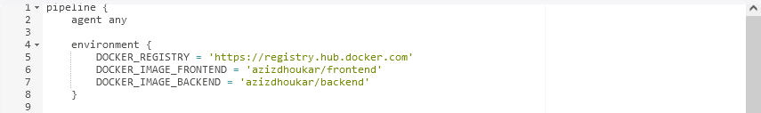

## Question 1:
The Docker files are in the Node and React folders, the docker-compose is in the root folder.

## Question 2:
- The PostgreSQL database is accessible only within the bridge app_network, isolating it from the internet and limiting access to containers within the same network.
- Admin credentials for the database are specified in the Docker Compose file, accessible only from the file system. Other users should have only the permissions they need.
- Regularly back up the database and store the backups securely.
- Use tools like Prometheus and Grafana to continuously monitor the container.

## Question 3:
- Implement a load balancer to distribute traffic among multiple instances of the application. Configure NGINX or HAProxy as the load balancer.
- Utilize Prometheus and Grafana to collect application-specific metrics, such as request rates, response times, and error rates, to determine when to scale up or down.
- If we are using Kubernetes, set up the Horizontal Pod Autoscaler (HPA) to scale the application pods based on resource utilization metrics.

## Question 4:
1. The Jenkinsfile is in the root directory.

- The provided Jenkins pipeline sets up a basic CI/CD environment. It uses agent any to run on any available Jenkins agent. The environment block defines three variables: DOCKER_REGISTRY for the Docker Hub URL, and DOCKER_IMAGE_FRONTEND and DOCKER_IMAGE_BACKEND for the names of the frontend and backend Docker images. This configuration standardizes the references to the Docker registry and image names across the pipeline.

- The git step is used to pull the code from the main branch of the repository, ensuring that the latest version of the code is available for subsequent stages in the pipeline.

- In this stage we build the Docker images for the frontend and backend. using the Dockerfiles located in the "./React/c_wave" and "./Node" directories, and tag the images with the "latest" version.

- Within this stage, there is a single step. using a script block to execute the necessary actions. The "docker.withRegistry" block specifies the Docker registry to which the images will be pushed, using the value stored in the "${DOCKER_REGISTRY}" variable.

- Within this stage we use the "sshagent" block to load and use the SSH credentials specified as "your-ssh-credentials" for SSH authentication.

- Inside the "sshagent" block, the "sh" command is used to execute an SSH command on the target server. The command connects to the server as the "user" specified and runs the "docker-compose -f /path/to/docker-compose.yml up -d" command. This command starts the application containers defined in the Docker Compose file, running them in detached mode (-d).

- this post-build step ensures that Docker images used in the deployment process are cleaned up by removing them after the deployment is complete. This helps to maintain a clean and efficient environment.

2. ssh-only.sh in the root directory.
